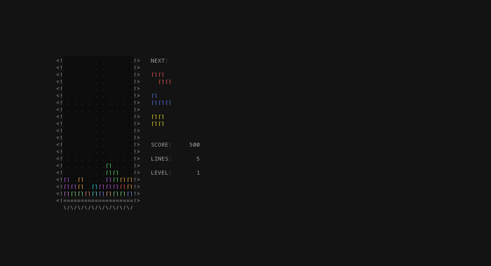
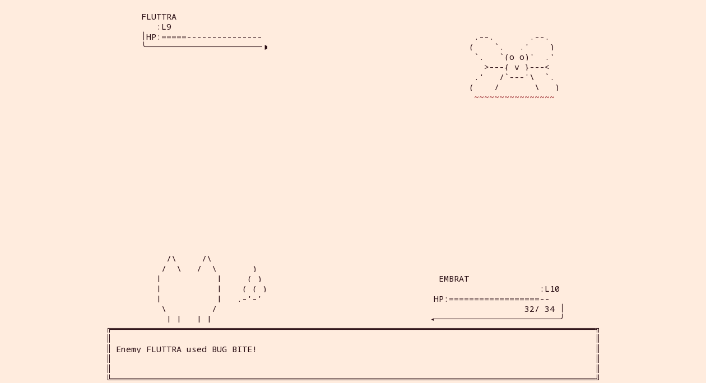
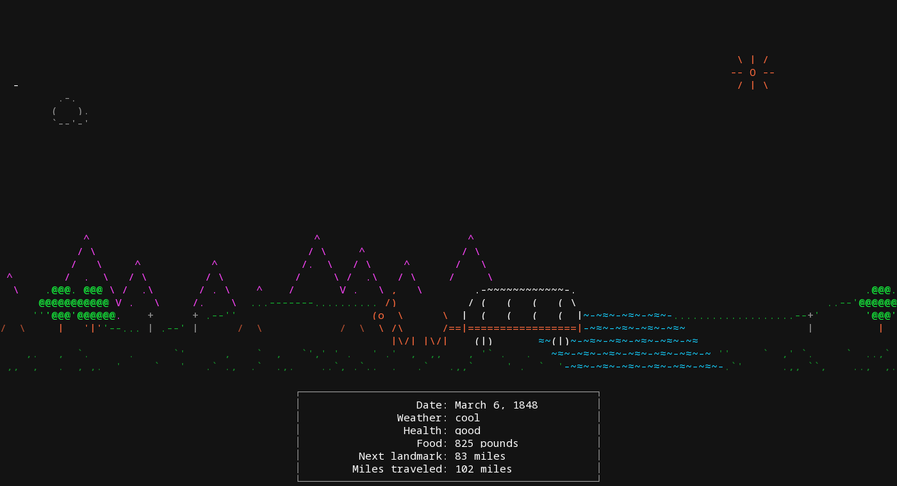
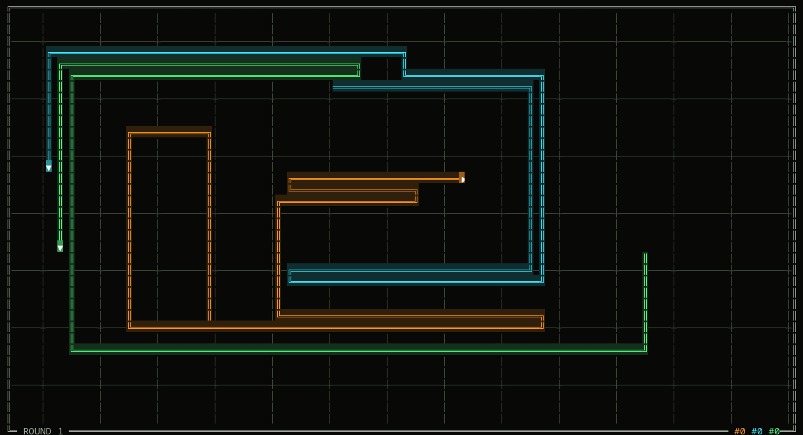

# lockscape

Lock-screen and wallpaper animations for the terminal: 22 self-playing ASCII scenes (Life, fireplace, aquarium, a Tetris
that plays itself, Pac-Man mazes, Tron light cycles, a 3D maze...), plus, if you bring your own ROMs, real games running
in their demo mode behind the lock screen, with the black bars filled in by the game's own mirrored picture.

| | | |
|---|---|---|
|  |  |  |
|  | | |

Pure Python 3.11+ standard library, truecolor terminal, no keyboard needed. Every scene picks random variants, so no two
runs look alike; scenes are dealt from a shuffle bag so each shows once before any repeats.

## Quick start

    git clone <this repo> && cd lockscape
    ./install.sh                  # symlinks into ~/.local/bin, creates the ROM folder, tells you what is missing
    lockscape                    # try it in any terminal: n = next scene, q = quit
    lockscape --list             # all scenes;  lockscape --mode tetris --clock  for one, with a clock

No install needed to just look: `python3 bin/lockscape`.

## Use it as a lock screen (Wayland, sway)

`lockscape-lock` runs an animation as the background of [swaylock-plugin](https://github.com/mstoeckl/swaylock-plugin),
through [windowtolayer](https://gitlab.freedesktop.org/mstoeckl/windowtolayer) and [foot](https://codeberg.org/dnkl/foot).

    # build windowtolayer once (needs rust): git clone https://gitlab.freedesktop.org/mstoeckl/windowtolayer && cd windowtolayer \
    #   && cargo build --release && cp target/release/windowtolayer ~/.local/bin/
    # sway config:
    exec swayidle -w timeout 300 lockscape-lock before-sleep lockscape-lock

Without swaylock-plugin, windowtolayer or foot, `lockscape-lock` just runs plain `swaylock`. It reuses your
`~/.config/swaylock/config` (minus options swaylock-plugin lacks). Logs go to `~/.cache/lockscape-lock.log`.
Optional: `patches/swaylock-plugin-clock.patch` makes the password ring show the time and date when you start typing.

## Colours

`lockscape` and `lockscape-lock` read `key=hex` colours from `$LOCKSCAPE_THEME`, `~/.config/lockscape/theme` or (for
Noctalia users) `~/.config/swaylock/noctalia-colors`; see `share/theme.example`.

## Real games (bring your own ROMs)

Put ROMs in `~/.local/share/lockscape/roms/` and run `lockscape-game --list`. They join the shuffle bag automatically.
Full guide, what is recognised, and limits: [roms/README.md](roms/README.md). Needs `mame` and/or `retroarch` + cores.
**No ROMs are included, and the project does not tell you where to get them.**

## Development

    python3 dev/smoke.py                      # every scene, 5 sizes from 10x6 to 250x70, flags crashes / slow scenes
    python3 dev/test_game_scene.py            # ROM discovery and layout tests, no display needed
    python3 dev/harness.py bin/lockscape Tetris --png out.png --at 20 --size 140x38   # render a frame as PNG

A scene is one `Scene` subclass in `bin/lockscape` (see `Tetris` or `Aquarium` for the idioms) added to `SCENES`.
Scenes must run at any size from 10x6 up, never get stuck, and fit their frame budget.

## Credits and legal

- The donut scene follows Andy Sloane's [donut math](https://www.a1k0n.net/2011/07/20/donut-math.html).
- Game-themed scenes are original ASCII homages; game names belong to their owners and no assets are copied.
  Full review: [docs/AUDIT.md](docs/AUDIT.md).
- Emulation is done by MAME, RetroArch and libretro cores, installed separately; swaylock-plugin and windowtolayer likewise.
- MIT licence, see LICENSE.
